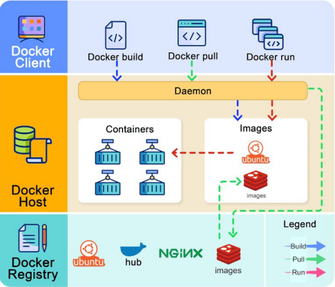

# Practica Calificada 5

Desarrollo y despliegue de una aplicación con Docker, Docker Compose, Kubernetes y microservicios

El juego Tower Defense es un videojuego de consola donde el jugador debe defender su base de oleadas de enemigos colocando torres en lugares estratégicos del mapa. El proyecto incluirá el uso de mocks, stubs y fakes para pruebas unitarias y de integración utilizando Mockito y pruebas de mutación.
**Objetivos de la actividad:**

1. Configurar y ejecutar contenedores Docker.
2. Configurar redes y volúmenes en Docker.
3. Usar docker exec para interactuar con contenedores en ejecución.
4. Implementar aplicaciones con Docker Compose.
5. Desplegar aplicaciones en Kubernetes.
6. Realizar pruebas unitarias y de integración utilizando Mockito.
7. Implementar pruebas de mutación para verificar la calidad de las pruebas.

Estructura del proyecto

**Clases principales:**

1. TowerDefenseGame: Clase principal que maneja la lógica del juego.
2. Map: Representa el mapa del juego.
3. Enemy: Clase base para todos los enemigos.
4. Tower: Clase base para todas las torres.
5. Wave: Maneja las oleadas de enemigos.
6. Player: Representa al jugador y sus estadísticas.

**Entrada y salida**
Entrada:
• Comandos del usuario para colocar torres, iniciar oleadas, etc.
• Datos iniciales del mapa y configuración de juego.
Salida:
• Estado del juego después de cada comando.
• Puntuación y estado de salud de la base.

Empezamos creando las clases 

## Clase principal Game

```java
package org.example;

import java.util.ArrayList;
import java.util.List;
import java.util.Scanner;

public class Game {
    public Map map;
    public Player player;
    public List<Wave> waves;
    public int currentWaveIndex;

    public Game() {
        this.map = new Map();
        this.player = new Player();
        this.waves = new ArrayList<>();
        this.currentWaveIndex = 0;
    }

    // Metodo poner la posicion y el tipo de la Torre
    // Metodo poner la posicion y el tipo de la Torre
    public void placeTower(String towerType, int x, int y) {
        TowerFactory factory;
        Tower tower = null;
        switch (towerType.toLowerCase()) {
            case "cannon":
                factory = new CannonTowerFactory();
                tower = factory.createCannonTower();
                break;
            case "laser":
                factory = new LaserTowerFactory();
                tower = factory.createLaserTower();
                break;
            case "arrow":
                factory = new ArrowTowerFactory();
                tower = factory.createArrowTower();
                break;
            default:
                System.out.println("Invalid tower type!");
                return;
        }

        // Añadir comprobación de validez de la posición
        if (tower != null && map.isValidPosition(x, y)) {
            map.insertarTower(tower, x, y);
            System.out.println("Torre " + towerType + " colocada en (" + x + ", " + y + ")");
        } else {
            System.out.println("Posicion invalida o tipo de torre no valido!");
        }
    }

    // Metodo para iniciar la ola
    public void startWave() {
        if (currentWaveIndex >= waves.size()) {
            Wave newWave = new Wave(currentWaveIndex + 1);
            waves.add(newWave);
        }
        Wave wave = waves.get(currentWaveIndex);
        System.out.println("Oleada " + (currentWaveIndex + 1) + " iniciada");
        System.out.println("Enemigos en camino...");
        // Aquí va la lógica para mover los enemigos y permitir que las torres ataquen
        Wave currentWave = waves.get(0);
        currentWave.getEnemies().forEach(enemy -> {
            // Agregar lógica para posicionar al enemigo, por ejemplo:
            int x = 1;
            int y = 1;
            if (map.isValidPosition(x, y)) {
                map.addEnemy(enemy);
            }
        });
        currentWaveIndex++;
    }

    // Metodo para imprimir el estado del Juego
    public void printGameState() {
        System.out.println("Estado del juego:");
        map.imprimirMapa();
        System.out.println("Puntuación: " + player.getScore());
        System.out.println("Vida de la base: " + player.getBaseHealth());
    }

    public static void main(String[] args) {
        Game game = new Game();
        Scanner scanner = new Scanner(System.in);
        System.out.println("Ingrese los comandos para jugar: ");

        while (true) {
            String command = scanner.nextLine();
            String[] parts = command.split(" ");
            switch (parts[0].toUpperCase()) {
                case "PLACE_TOWER":
                    String towerType = parts[1];
                    int x = Integer.parseInt(parts[2]);
                    int y = Integer.parseInt(parts[3]);
                    game.placeTower(towerType, x, y);
                    break;
                case "START_WAVE":
                    game.startWave();
                    break;
                case "PRINT_STATE":
                    game.printGameState();
                    break;
                default:
                    System.out.println("Comando no reconocido");
            }
        }
    }
}

```

## Clase Map

```java
package org.example;

import java.util.ArrayList;
import java.util.List;

public class Map {
    private char[][] mapa;
    private final int filas;
    private final int columnas;
    private List<Enemy> activeEnemies;

    // Constructor que inicializa el mapa con un diseño ya predefinido
    public Map() {
        this.filas = 5;
        this.columnas = 5;
        this.mapa = new char[][] {
                {' ', ' ', 'C', ' ', ' '},
                {' ', 'C', ' ', ' ', ' '},
                {'C', ' ', ' ', 'C', 'B'},
                {' ', ' ', 'C', ' ', ' '},
                {' ', ' ', ' ', ' ', ' '}
        };
        activeEnemies = new ArrayList<>();
    }

    public char[][] getMapa() {
        return mapa;
    }

    // Método para imprimir el mapa
    public void imprimirMapa() {
        for (int i = 0; i < filas; i++) {
            for (int j = 0; j < columnas; j++) {
                System.out.print("[" + mapa[i][j] + "]");
            }
            System.out.println();
        }
    }

    // Método para obtener la posición de la base 'B'
    public int[] obtenerPosicionBase() {
        int[] posicionBase = new int[2];
        for (int i = 0; i < filas; i++) {
            for (int j = 0; j < columnas; j++) {
                if (mapa[i][j] == 'B') {
                    posicionBase[0] = i;
                    posicionBase[1] = j;
                    return posicionBase;
                }
            }
        }
        return posicionBase;
    }

    // Metodo para insertar en una posicion la torre 'T'
    public void insertarTower(Tower tower, int x, int y) {
        if (isValidPosition(x, y)) {
            mapa[x][y] = 'T'; // 'T' representará una torre
        } else {
            System.out.println("No se puede colocar la torre en esa posición");
        }
    }

    // Metodo para insertar una ola de enemigos
    public void addEnemy(Enemy enemy) {
        activeEnemies.add(enemy);
        mapa[enemy.getX()][enemy.getY()] = 'E';
    }

    // Método para verificar si una posición es válida en el mapa
    public boolean esPosicionValida(int fila, int columna) {
        return fila >= 0 && fila < filas && columna >= 0 && columna < columnas;
    }

    public boolean isValidPosition(int x,int y){
        if(mapa[x][y] == ' '){
            return true;
        }else {
            System.out.println("No se puede colocar la torre en esa posición");
            return false;
        }
    }

    // Método para obtener el contenido de una posición específica del mapa
    public char contenidoEnPosicion(int fila, int columna) {
        if (esPosicionValida(fila, columna)) {
            return mapa[fila][columna];
        } else { // Si es que la posicion insertada esta fuera del mapa
            throw new IllegalArgumentException("Posición fuera de los límites del mapa.");
        }
    }
}

```

## Clase Player

```java
package org.example;

public class Player {
    private int score; // Puntuación del jugador
    private int baseHealth; // Salud de la base del jugador

    // Constructor que inicializa la puntuación y la salud de la base
    public Player() {
        this.score = 0;
        this.baseHealth = 100;
    }

    // Método para agregar puntos a la puntuación del jugador
    public void addScore(int points) {
        this.score += points;
    }

    // Método para deducir salud de la base
    public void deductBaseHealth(int damage) {
        this.baseHealth -= damage;
        if (this.baseHealth < 0) {
            this.baseHealth = 0; // Asegurar de que la salud de la base no sea negativa
        }
    }

    // Getters para la puntuación y la salud de la base
    public int getScore() {
        return score;
    }

    public int getBaseHealth() {
        return baseHealth;
    }

    // Método para verificar si la base ha sido destruida
    public boolean isBaseDestroyed() {
        return this.baseHealth <= 0;
    }

    // Método para actualizar la puntuación y la salud de la base
    public void updateScoreAndHealth(Enemy enemy, int damage) {
        boolean defeated = enemy.isDefeated();
        if (defeated) {
            // Si el enemigo fue derrotado, se suma la recompensa a la puntuación
            addScore(enemy.getReward());
        } else {
            // Si el enemigo no fue derrotado y alcanzó la base, se deduce la salud de la base
            deductBaseHealth(damage);
        }
    }
}

```

## Clase Tower

```java
package org.example;

import java.util.List;

public class Tower {
    private int damage;
    private int range;
    private int fireRate;
    private int[] position;

    public Tower(int damage, int range, int fireRate) {
        this.damage = damage;
        this.range = range;
        this.fireRate = fireRate;
    }

    public int getDamage() {
        return damage;
    }

    public void setDamage(int damage) {
        this.damage = damage;
    }

    public int getRange() {
        return range;
    }

    public void setRange(int range) {
        this.range = range;
    }

    public int getFireRate() {
        return fireRate;
    }

    public void setFireRate(int fireRate) {
        this.fireRate = fireRate;
    }

    public int[] getPosition() {
        return position;
    }

    public void setPosition(int x, int y) {
        this.position = new int[]{x, y};
    }

    public void attack(List<Enemy> enemies, Map map) {
        for (Enemy enemy : enemies) {
            if (isEnemyWithinRange(enemy, map)) {
                enemy.setHealth(enemy.getHealth() - damage);
            }
        }
    }

    public boolean isEnemyWithinRange(Enemy enemy, Map map) {
        if (map == null) {
            return false; // Si el mapa es nulo, no hay enemigos en el rango
        }

        int xStart = Math.max(0, position[0] - range);
        int xEnd = Math.min(map.getMapa().length - 1, position[0] + range);
        int yStart = Math.max(0, position[1] - range);
        int yEnd = Math.min(map.getMapa()[0].length - 1, position[1] + range);

        int enemyX = enemy.getX();
        int enemyY = enemy.getY();

        return enemyX >= xStart && enemyX <= xEnd && enemyY >= yStart && enemyY <= yEnd;
    }
}

```

## Clase Wave

```java
package org.example;

import java.util.ArrayList;
import java.util.List;

public class Wave {
    private List<Enemy> enemies; // Lista de enemigos en la oleada
    private int waveNumber; // Número de la oleada
    private static final int START_X = 0; // Posición inicial X de los enemigos
    private static final int START_Y = 2; // Posición inicial Y de los enemigos

    // Constructor que inicializa la oleada
    public Wave(int waveNumber) {
        this.waveNumber = waveNumber;
        this.enemies = generateEnemies(waveNumber);
    }

    // Método para generar enemigos basado en el número de la oleada
    private List<Enemy> generateEnemies(int waveNumber) {
        List<Enemy> enemies = new ArrayList<>();

        // Agregar enemigos básicos a la oleada
        for (int i = 0; i < waveNumber * 5; i++) { // Más enemigos cada oleada
            enemies.add(new BasicEnemy());
        }

        // Agregar enemigos rápidos cada 3 oleadas
        if (waveNumber % 3 == 0) {
            for (int i = 0; i < waveNumber; i++) {
                enemies.add(new SpeedyEnemy());
            }
        }

        // Agregar un jefe cada 5 oleadas
        if (waveNumber % 5 == 0) {
            enemies.add(new BossEnemy());
        }

        return enemies;
    }

    // Método para obtener la lista de enemigos de la oleada
    public List<Enemy> getEnemies() {
        return enemies;
    }

    // Método para generar y colocar los enemigos en el mapa
    public void spawnEnemies(Map map) {
        for (Enemy enemy : enemies) {
            enemy.setPosition(START_X, START_Y);
            map.addEnemy(enemy);
        }
    }

    // Método para manejar el progreso de la oleada
    public boolean isWaveDefeated() {
        // La oleada se considera derrotada si todos los enemigos han sido derrotados
        for (Enemy enemy : enemies) {
            if (!enemy.isDefeated()) {
                return false;
            }
        }
        return true;
    }

    // Método para obtener el número de la oleada
    public int getWaveNumber() {
        return waveNumber;
    }
}

```

# Pregunta 1

❓Describe los principios fundamentales de los contenedores Docker y su arquitectura interna. 

❓Explica cómo Docker maneja la seguridad y el aislamiento de contenedores.

## Teoria

✅Docker es una plataforma de software que permite crear, probar y desplegar aplicaciones rápidamente, empaquetando el software en unidades estandarizadas llamadas contenedores.

### Principios fundamentales de Docker

**Imágenes y contenedores**: Una imagen es una plantilla que incluye todo lo necesario para que una aplicación funcione como si fuera una libreria. Un contenedor es una instancia de una imagen en ejecución.

**Es portable**: Al empaquetar una aplicación y sus dependencias en un contenedor, funciona igual en cualquier entorno.

**Es Aislado**: Cada contenedor está aislado de los demás, por lo que no comparten recursos directamente y no se interfieren entre sí.

### Arquitectura interna de Docker

- **Docker Engine o Host**: Es el motor central que gestiona la creación, ejecución y administración de contenedores.
- **Docker Daemon**: Es el servicio que corre en segundo plano y se encarga de todas las operaciones de Docker.
- **Docker Client**: Es la interfaz de línea de comandos que los usuarios utilizan para interactuar con Docker Daemon.
- **Docker Hub**: Es un repositorio donde se almacenan y se comparten imágenes Docker.



### Seguridad y aislamiento en Docker

Docker maneja la seguridad y el aislamiento principalmente a través de:

Cada contenedor tiene su propio sistema de archivos, red y procesos aislados de los otros contenedores; tambien su distribucion de los recursos (CPU, memoria, disco,red) que puede usar cada contenedor.

Docker tiene herramientas que restringen las llamadas al sistema o acciones que pueden realizar los contenedores, por lo que se proporciona seguridad.

### Docker vs Maquinas Virtuales

Docker funciona utilizando el kernel del sistema operativo para crear contenedores lo que lo vuelve menos pesado en cambio las maquibas virtuales utilizan un hypervisor para crear las maquinas virtuales las cuales tienen un sistema operativo dentro para ejecutar las aplicaciones.


Ventajas de Docker:

- No necesita Hypervisor
- Uso eficiente de recursos (CPU,memoria)
- Menor consumo de disco
- Levantan muy rapido
- Ideales para Microservicios
- Faciles de transportar y recrear

## Practico:

## Configuracion de Docker

Primero vamos a crear un  Dockerfile en la carpeta donde se encuentra nuestro proyecto.

Abrimos una terminal en la direccion de la carpeta del proyecto y escribimos el siguiente comando:

```java
docker init
```


Aqui seleccionamos el idioma de nuestro proyecto, docker detecto que se trata de Java.

docker init nos guiara a través de algunas preguntas para configurar el proyecto con valores predeterminados razonables.


Vemos que se creo el Dockerfile y el docker-compose.yml en la siguiente ubicacion:


Ahora podemos modificar el dockerfile para nuestro proyecto.

```docker
# Ponemos la imagen base que proporcionara un entorno de ejecucion de Java
FROM openjdk:17
# Establece el directorio de trabajo dentro del contenedor
WORKDIR /app

# Copy los archivos que se encuentran en el directorio (.) de la ubicacion del dockerfile
# a la carpeta /app del contenedor
COPY . /app

# Ejecuta el comando javac dentro del contenedor para compilar todos los archivos .java
# que se encuentran en el directorio src/main/java/org/example.
RUN javac src/main/java/org/example/*.java
# Especifica el comando por defecto que se ejecutara cuando inicie el contenedor
# Se ejecutara la clase TowerDefenseGame utilizando el comando "java"
CMD ["java","-cp","/app/src/main/java","org.example.Game"]
```

### Construccion de la Imagen Docker

Utilizamos el siguiente comando 

Para construir una imagen de Docker a partir de nuestro Dockerfile.


### Ejecucion del contenedor

Utilizamos el siguiente comando


## Interaccion con contenedores usando docker exec

Primero vamos a acceder al contenedor en ejecucion para lo cual utilizamos el siguiente comando

```docker
docker exec -it tower-defense-container /bin/bash
```

Ahora ejecutaremos comandos dentro del contenedor en este caso use los comandos de linux para ver el contenido del directorio donde se encontraban todas las clases del juego.


---

# Pregunta 2

❓Explica en detalle cómo Docker maneja las redes y los volúmenes. Discute los diferentes tipos de redes (bridge, host, overlay) y cuándo es apropiado usar cada una.
❓Describe los mecanismos de persistencia de datos en Docker, incluyendo volúmenes y bind mounts. Explica las diferencias entre ellos y las mejores prácticas para su uso.

## Teoria:

### ✅Redes en Docker

Docker maneja las redes para que los contenedores puedan comunicarse entre sí y con el exterior. Tenemos tres tipos de redes:

**Bridge** : Es la red predeterminada para contenedores en un solo host. Es apropiado usarla para contenedores que necesitan comunicarse dentro del mismo host pero no necesitan ser accesibles desde fuera del host.

**Host** : El contenedor comparte la red del host directamente. Es utili cuando se necesita el maximo rendimiento de red.

**Overlay**: Permite la comunicación entre contenedores en diferentes hosts. Es Ideal para clústeres de Kubernetes, donde los contenedores necesitan comunicarse a través de múltiples servidores.

### ✅Persistencia de Datos en Docker

Docker maneja la persistencia de datos a través de volúmenes y bind mounts, que permiten a los contenedores almacenar datos que persisten mucho tiempo.

**Volúmenes**: Es Administrado por Docker, se almacenan en una ruta específica en el host, permiten compartir datos entre contenedores sin preocuparse por la ubicación exacta en el host.

**Bind Mounts**: Monta un directorio o archivo específico del host en el contenedor se tiene mayor control sobre la ubicación de los datos, es útil para desarrollo y pruebas.

## Practico:

## Configuracion de redes y volumenes de Docker

### Crear una red personalizada

Utilizamos el siguiente comando


### Ejecutar el contenedor en la red

Utilizamos el siguiente comando


### Crear y montar un Volumen

Usamos los siguientes comandos.


El volumen que creamos podemos observarlo en el docker desktop


Ahora usaremos el siguiente comando para hacer uso del volumen que creamos usando el contendor que tenemos.

```docker
docker run -it --name tower-defense-container --network game-network -v game-data:/app/data tower-defense-game
```

`tower_defense-container`: nombre del contenedor

`game-network`: red a la que se conecta el contenedor

`-v game-data:/app/data`: monta un volumen llamado game-data dentro del contendor directorio /app/data 

`tower-defense-game`: nombre de la imagen del contenedor


## Implementacion con Docker Compose

Creamos un archivo docker-compose.yml

```yaml
version: '3'
services:
  game:
    image: tower-defense-game
    networks:
      - game-network
    volumes:
      - game-data:/app/data

networks:
  game-network:
    driver: bridge

volumes:
  game-data:
    driver: local
```

Iniciamos los servicios


En el docker desktop nos aparecera lo siguiente:


---

# Pregunta 3

❓Describe la arquitectura de Kubernetes y sus componentes principales, incluyendo el API server, etcd, scheduler, y kubelet. Explica cómo estos componentes interactúan para gestionar un clúster de Kubernetes.
❓Discute las estrategias de escalabilidad y alta disponibilidad en Kubernetes. Explica cómo Kubernetes maneja la recuperación de fallos y la gestión de réplicas.

## Teoria

✅Kubernetes es una plataforma para gestionar contenedores como un director de orquesta que asegura que cada contenedor se ejecute correctamente.

**El API Server** actua como punto central es el que procesa las operaciones de los usuarios. **etcd** es un almacen de datos que guarda el estado del cluster.

El **Scheduler** es el que se encarga de asignar los pods a los nodos adecuados, donde cada nodo en el cluster ejecuta un **Kubetel** que asegura que el contenedor se ejecute en un Pod.

✅Kubernets tiene 2 tipos de **escabilidad** una que permite añadir mas nodos al cluster(escabilidad horizontal) o aumentar los recursos de los nodos (escabilidad vertical). La **disponibilidad** de kurbernetes funciona replicando compomentes como el API Server y distribuyendo los nodos en diferentes zonas de disponibilidad.

Kubernetes maneja la **recuperacion de fallos** reprogramando pods en otros nodos cuando uno falla y ajusta de forma dinamica el **numero de replicas** de pods segun lo definido.

## Practico

## Despliegue en Kubernetes

Vamos a crear un servicio de despliegue y servicio llamados **deployment.yaml** y **service.yaml**

deployment.yaml :

```yaml
apiVersion: apps/v1
kind: Deployment
metadata:
  name: tower-defense-deployment
spec:
  replicas: 1
  selector:
    matchLabels:
      app: tower-defense-game
  template:
    metadata:
      labels:
        app: tower-defense-game
    spec:
      containers:
        - name: tower-defense-game
          image: tower-defense-game
          ports:
            - containerPort: 8080

```

Primero, se especifica la versión de la API de Kubernetes con `apiVersion: apps/v1`. Luego, se define el recurso como un Deployment con `kind: Deployment`. Se proporcionan metadatos para el recurso, incluyendo el nombre del Deployment como `metadata: name: tower-defense-deployment`.

En la sección `spec` del Deployment, se configura que solo se ejecute una réplica del pod con `replicas: 1`. Se establece el criterio para seleccionar qué pods forman parte de este Deployment usando `selector: matchLabels: app: tower-defense-game`.

Dentro de la sección `template`, se especifica cómo debe ser cada pod generado por el Deployment. Esto incluye metadatos y especificaciones para los contenedores que se ejecutarán en el pod. El contenedor está basado en la imagen `tower-defense-game` y expone el puerto 8080 mediante `ports: - containerPort: 8080`.

service.yaml :

```yaml
apiVersion: v1
kind: Service
metadata:
  name: tower-defense-service
spec:
  selector:
    app: tower-defense-game
  ports:
    - protocol: TCP
      port: 80
      targetPort: 8080
  type: LoadBalancer

```

En el archivo YAML, `apiVersion: v1` especifica la versión de la API de Kubernetes a utilizar. `kind: Service` indica que se está creando un servicio. `metadata: name: tower-defense-service`, se define el nombre del servicio como "tower-defense-service".

En la sección `spec` del servicio, `selector: app: tower-defense-game` especifica que el servicio debe enrutar el tráfico hacia los pods que tengan la etiqueta `app: tower-defense-game`. Mediante `ports:`, se definen los puertos que el servicio expondrá. Finalmente, `type: LoadBalancer` indica a Kubernetes que debe utilizar un balanceador de carga para distribuir el tráfico de red entrante entre los pods correspondientes.

## Aplicar los archivos de configuracion en Kubernetes

Para eso aplicamos los siguientes comandos.


Los comandos `kubectl apply -f deployment.yml` y `kubectl apply -f service.yml` se utilizan para aplicar las configuraciones de despliegue y servicio en un clúster de Kubernetes. Estos comandos son responsables de crear los pods y servicios necesarios para ejecutar una aplicación específica. Una vez ejecutados, Kubernetes procederá a desplegar la aplicación según las configuraciones definidas en los archivos de despliegue (`deployment.yml`) y servicio (`service.yml`).

### Verificar el estado del despliegue

Utilizamos los siguientes comandos


`kubectl get pods` muestra todos los pods en ejecución dentro del clúster de Kubernetes. `kubectl get services` muestra todos los servicios disponibles en el clúster de Kubernetes. Los servicios en Kubernetes facilitan el acceso a los pods desde fuera del clúster, permitiendo así la comunicación con las aplicaciones y servicios desplegados en la infraestructura de Kubernetes.

---

# Pregunta 4

❓Explica los conceptos de mocks, stubs y fakes. Discute cuándo y cómo se deben utilizar estos patrones en las pruebas unitarias.
❓Describe el proceso de creación de pruebas unitarias con Mockito. Explica cómo se pueden simular dependencias y verificar comportamientos en las pruebas.

## Teoria

✅ Los **mocks** son objetos que simulan el comportamiento de objetos reales de manera controlada y se utilizan en pruebas unitarias e integración. Los **stubs** son objetos cuyo propósito principal es evitar que las pruebas dependan de la implementación real de métodos específicos. Los **fakes** son implementaciones simplificadas de clases o interfaces que incluyen lógica de negocio, aunque esta es considerablemente más simple que la implementación real.

## Practico

Primero Añadimos Mockito a nuestro build.gradle:


## Implementacion de Pruebas

Usamos mockito para hacer las pruebas unitarias y de integracion 

### Clase Game

```java
package org.example;

import static org.junit.jupiter.api.Assertions.*;
import static org.mockito.Mockito.*;
import org.junit.jupiter.api.BeforeEach;
import org.junit.jupiter.api.Test;
import org.mockito.Mock;
import org.mockito.MockitoAnnotations;

public class GameTest2 {

    @Mock
    private Map mockMap;

    private Game game;

    @BeforeEach
    public void setUp() {
        MockitoAnnotations.openMocks(this);
        game = new Game();
        game.map = mockMap;  // Injectar el mock de Map en el juego
    }

    @Test
    public void testPlaceTower_ValidCannonTower() {
        // Configurar mock para posición válida
        when(mockMap.isValidPosition(3, 4)).thenReturn(true);

        game.placeTower("cannon", 3, 4);

        // Verificar que la torre se haya colocado
        verify(mockMap).insertarTower(any(CannonTower.class), eq(3), eq(4));
    }

    @Test
    public void testPlaceTower_ValidLaserTower() {
        // Configurar mock para posición válida
        when(mockMap.isValidPosition(3, 4)).thenReturn(true);

        game.placeTower("laser", 3, 4);

        // Verificar que la torre se haya colocado
        verify(mockMap).insertarTower(any(LaserTower.class), eq(3), eq(4));
    }

    @Test
    public void testPlaceTower_ValidArrowTower() {
        // Configurar mock para posición válida
        when(mockMap.isValidPosition(3, 4)).thenReturn(true);

        game.placeTower("arrow", 3, 4);

        // Verificar que la torre se haya colocado
        verify(mockMap).insertarTower(any(ArrowTower.class), eq(3), eq(4));
    }

    @Test
    public void testPlaceTower_InvalidPosition() {
        // Configurar mock para posición inválida
        when(mockMap.isValidPosition(3, 4)).thenReturn(false);

        game.placeTower("cannon", 3, 4);

        // Verificar que la torre no se haya colocado
        verify(mockMap, never()).insertarTower(any(Tower.class), eq(3), eq(4));
    }

    @Test
    public void testPlaceTower_InvalidTowerType() {
        // Configurar mock para cualquier posición
        when(mockMap.isValidPosition(anyInt(), anyInt())).thenReturn(true);

        game.placeTower("invalidType", 3, 4);

        // Verificar que la torre no se haya colocado
        verify(mockMap, never()).insertarTower(any(Tower.class), eq(3), eq(4));
    }
}

```

Utilizamos Mockito para simular el comportamiento del mapa (`Map`) para probar el comportamiento de la clase `Game` al colocar diferentes tipos de torres en diferentes condiciones (posición válida, inválida, tipo de torre válido e inválido). Cada prueba verifica que las interacciones esperadas entre `Game` y `Map` ocurran correctamente según la lógica definida en el método `placeTower()` de `Game`.

Ejecutamos las pruebas


### Clase Tower

```java
package org.example;

import static org.junit.jupiter.api.Assertions.assertEquals;

import java.util.Arrays;
import java.util.List;

import org.junit.jupiter.api.BeforeEach;
import org.junit.jupiter.api.Test;

public class TowerTest2 {
    private Tower tower;
    private Map map;

    @BeforeEach
    public void setUp() {
        tower = new Tower(50, 2, 1);
        tower.setPosition(2, 1);
        map = new Map(); // Inicializa el mapa con el diseño predefinido
    }

    @Test
    public void testAttack_EnemyInRange() {
        List<Enemy> enemies = Arrays.asList(new Enemy(1, 100, 10));
        enemies.get(0).setPosition(2, 2); // Enemigo dentro del rango de la torre
        map.addEnemy(enemies.get(0)); // Agrega el enemigo al mapa

        tower.attack(enemies, map);

        // Verificar que el enemigo ha recibido daño
        assertEquals(50, enemies.get(0).getHealth());
    }

    @Test
    public void testAttack_EnemyOutOfRange() {
        List<Enemy> enemies = Arrays.asList(new Enemy(1, 100, 10));
        enemies.get(0).setPosition(4, 4); // Enemigo fuera del rango de la torre
        map.addEnemy(enemies.get(0)); // Agrega el enemigo al mapa

        tower.attack(enemies, map);

        // Verificar que el enemigo no ha recibido daño
        assertEquals(100, enemies.get(0).getHealth());
    }
}

```

`assertEquals` verifica el comportamiento del método `attack()` de la clase `Tower`. Se aseguran de que la torre cause daño solo a los enemigos dentro de su alcance y no a los que están fuera de ese alcance, utilizando una configuración inicial predefinida y simulando interacciones mediante objetos `Enemy` y `Map`.

Ejecutamos las pruebas


### Clase Wave

```java
package org.example;

import static org.junit.jupiter.api.Assertions.*;
import static org.mockito.Mockito.*;

import org.junit.jupiter.api.BeforeEach;
import org.junit.jupiter.api.Test;

import java.util.Arrays;
import java.util.Collections;

public class WaveTest {
    private Game game;
    private Map mockMap;
    private Player mockPlayer;

    @BeforeEach
    public void setUp() {
        game = new Game();
        mockMap = mock(Map.class);
        mockPlayer = mock(Player.class);
        game.map = mockMap;
        game.player = mockPlayer;
    }

    @Test
    public void testStartWave_WithEnemies() {
        Enemy enemy = mock(BasicEnemy.class);
        Wave wave = new MockWave(1, Arrays.asList(enemy));
        game.waves.add(wave);

        when(mockMap.isValidPosition(anyInt(), anyInt())).thenReturn(true);

        game.startWave();

        // Verificar que los enemigos han sido generados y la oleada ha comenzado
        assertFalse(game.waves.get(0).getEnemies().isEmpty());
        verify(mockMap, times(1)).addEnemy(enemy);
    }

    @Test
    public void testStartWave_NoEnemies() {
        Wave wave = new MockWave(1, Collections.emptyList());
        game.waves.add(wave);

        game.startWave();

        // Verificar que no se han generado enemigos
        assertTrue(game.waves.get(0).getEnemies().isEmpty());
        verify(mockMap, never()).addEnemy(any(Enemy.class));
    }

    @Test
    public void testStartWave_NewWaveAdded() {
        game.startWave();

        // Verificar que una nueva oleada ha sido añadida
        assertEquals(1, game.waves.size());
        assertEquals(1, game.currentWaveIndex);
    }

    @Test
    public void testStartWave_ExistingWaveContinued() {
        Wave existingWave = new MockWave(1, Arrays.asList(mock(BasicEnemy.class)));
        game.waves.add(existingWave);

        game.startWave();

        // Verificar que la oleada existente se ha continuado
        assertEquals(1, game.currentWaveIndex);
        assertEquals(existingWave, game.waves.get(0));
    }

    @Test
    public void testStartWave_EndOfWavesList() {
        game.waves.add(new MockWave(1, Arrays.asList(mock(BasicEnemy.class))));

        game.startWave();
        game.startWave();

        // Verificar que se añade una nueva oleada cuando se alcanzan los límites de la lista de oleadas
        assertEquals(2, game.waves.size());
        assertEquals(2, game.currentWaveIndex);
    }
}

```

Mockito verifica varios escenarios del inicio de oleadas de enemigos en el juego `Game`. Se utilizan mocks para simular el comportamiento de `Map` y `Player`, y se verifican diferentes aspectos como la generación de enemigos, la continuación de oleadas existentes y la adición de nuevas oleadas a la lista.

Ejecutamos las pruebas


# Pregunta 5

❓Define qué son las pruebas de mutación y cómo contribuyen a la mejora de la calidad del software. Explica los tipos de operadores de mutación y su propósito.
❓Discute las métricas utilizadas para evaluar la efectividad de las pruebas de mutación, como la tasa de mutación (mutation score) y la cobertura de mutación.

## Teoria

✅Las **pruebas de mutación** son una técnica avanzada de pruebas que buscan evaluar la robustez de un conjunto de pruebas existentes al introducir mutaciones controladas en el código. Estas mutaciones simulan errores típicos que podrían ocurrir durante el desarrollo, como cambios en **operadores** lógicos, condiciones de control, o valores de constantes. Al aplicar estas mutaciones y ejecutar las pruebas, se evalúa la capacidad del conjunto de pruebas para detectar y reportar estos errores simulados. Esto ayuda a mejorar la calidad del software al identificar áreas del código que no están suficientemente cubiertas por las pruebas existentes.

Los tipos de **operadores de mutacion** son los siguientes:
operadores de sustitución (cambio de operadores lógicos o aritméticos), operadores de inserción (añadir nuevos elementos como instrucciones o variables), y operadores de eliminación (eliminar o desactivar porciones de código).

✅ Para medir la **efectividad** de las pruebas de mutación, se utilizan métricas como la tasa de mutación (mutation score) y la cobertura de mutación. La tasa de mutación representa el porcentaje de mutaciones que son detectadas por el conjunto de pruebas. Una alta tasa de mutación indica que las pruebas son efectivas para detectar cambios en el comportamiento del código. 

La **cobertura** de mutación evalúa qué porcentaje del código es afectado por las mutaciones introducidas, proporcionando insights sobre la calidad y la exhaustividad de las pruebas.

## Practico

### Implementacion de pruebas de mutacion

Primero haremos la configuramos las dependecias para poder usar Pitest con gradle.

```java
plugins {
    id 'java'
    id 'info.solidsoft.pitest' version '1.15.0'
}

group = 'org.example'
version = '1.0-SNAPSHOT'

repositories {
    mavenCentral()
}

dependencies {
    testImplementation 'org.junit.jupiter:junit-jupiter-api:5.7.0'
    testRuntimeOnly 'org.junit.jupiter:junit-jupiter-engine:5.7.0'
    testImplementation 'org.junit.jupiter:junit-jupiter'
    testImplementation 'org.assertj:assertj-core:3.25.3'
    testImplementation 'org.mockito:mockito-core:4.3.1'
    testImplementation 'org.mockito:mockito-junit-jupiter:4.3.1'
    pitest 'org.pitest:pitest-junit5-plugin:1.1.0'
}

test {
    useJUnitPlatform()
}

pitest {
    targetClasses = ['org.example.*'] // Paquete de clases a mutar
    mutators = ['DEFAULTS'] // Conjunto de mutadores [OLD_DEFAULTS, DEFAULTS, STRONGER, ALL]
    outputFormats = ['HTML'] // Formato de salida del informe
    timestampedReports = false // Deshabilitar informes con marca de tiempo para facilitar la navegación
    verbose = true
}
```

Ahora ejecutaremos Pitest con el siguiente comando:

```java
./gradlew pitest
```


### Analisis de los resultados

- **Cobertura de Líneas de Código:**
    - La cobertura de líneas de código varía significativamente entre las clases, oscilando entre un mínimo del 0% en algunas clases como `BossEnemyFactory` y `FastEnemyFactory`, y alcanzando un máximo del 100% en clases como `BasicEnemyFactory` y `FakeBaseDeDatosPuntuacion`.
    - El promedio general de cobertura de líneas es del 52%, indicando que aproximadamente la mitad del código está siendo ejecutado durante las pruebas.
- **Cobertura de Mutación:**
    - La cobertura de mutación muestra resultados menos satisfactorios, con un promedio del 24%. Esto sugiere que solo alrededor de una cuarta parte de las mutaciones introducidas fueron detectadas por las pruebas existentes.
    - Algunas clases como `BossEnemyFactory.java` y `Wave.java` muestran una cobertura de mutación del 0%, lo que indica una incapacidad para detectar errores simulados en estas áreas.
- **Fuerza de las Pruebas:**
    - La fuerza de las pruebas, medida como la proporción de mutaciones detectadas respecto a las mutaciones totales introducidas, tiene un promedio del 53%. Esto sugiere que las pruebas tienen una capacidad moderada para detectar errores introducidos intencionalmente en el código.

### Recomendaciones para mejorar

- Identificar y priorizar las clases con baja cobertura de líneas de código, especialmente aquellas con menos del 50% y se deben agregar pruebas adicionales para aumentar la cobertura.
- Implementar pruebas adicionales enfocadas en las áreas con baja cobertura de mutación. Esto puede lograrse introduciendo más casos de prueba que cubran diferentes escenarios y límites del código.
- Asegurarse de que las pruebas no solo cubran las pruebas unitarias, sino también la integración entre diferentes componentes y el comportamiento funcional del sistema como un todo.

# Pregunta 6

❓Explica el concepto de diseño por contrato y cómo se aplica en el desarrollo de software.Discute las diferencias entre precondiciones, postcondiciones e invariantes.
❓Describe cómo el diseño por contrato puede mejorar la robustez y mantenibilidad del código

## Teoria

✅Las especificaciones precisas y verificables para los componentes del software, como clases y métodos, se definen como "**contratos**". Estos contratos detallan las **precondiciones** que un método debe cumplir antes de ejecutarse, las **postcondiciones** que asegura cumplir después de su ejecución, y los **invariantes** que deben mantenerse constantes durante su ejecución. Estos contratos son fundamentales para garantizar la consistencia y el correcto funcionamiento del software, estableciendo reglas claras y comprobables para cada componente del sistema.

✅El diseño por contrato puede aumentar la **robustez** del código al establecer claramente las expectativas de comportamiento para cada método. Esto permite al sistema detectar de manera automática cuando estas expectativas no son cumplidas.

## Practico